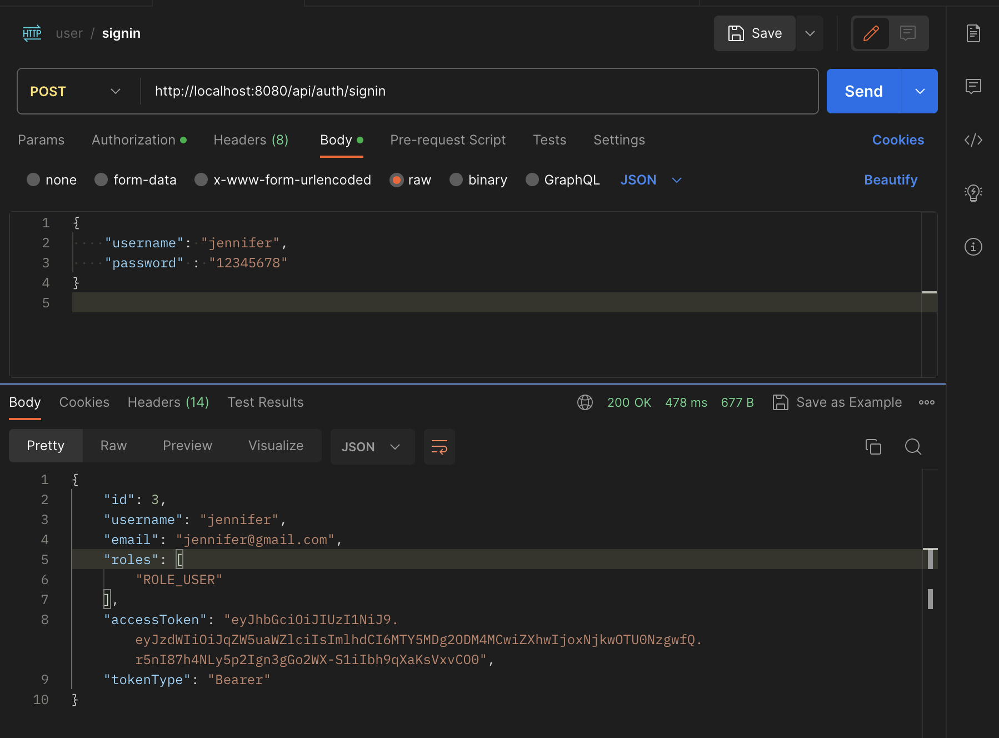

# Spring Boot & Spring Security & Docker & MySQL Project

## Run following SQL insert statements
```
INSERT INTO roles(name) VALUES('ROLE_USER');
INSERT INTO roles(name) VALUES('ROLE_MODERATOR');
INSERT INTO roles(name) VALUES('ROLE_ADMIN');
```

## User Registration, User Login and Authorization process.





## Run Spring Boot application
```
mvn spring-boot:run
```
